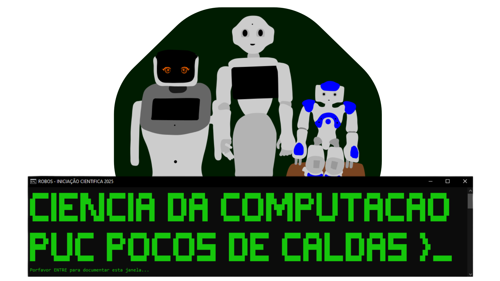

A intenção deste repositório, é de traduzir e/ou criar uma nova, documentação dos robôs disponíveis na PUC de Poços de Caldas.
# Objetivos
- Registrar datas e descrever as atividades realizadas no Laboratório.
- Listar e indicar problemas de hardware/software que encontrarmos.
- Possibilitar a colaboração e comunicação de outros envolvidos no projeto.
# História
A universidade, em parceria com a empresa PluginBot. Recebeu três modelos para estudos e testes: NAO, Pepper e o Elf.
O projeto surgiu na disciplina de "Robôs, Sensores e Aplicações", do 3° período do curso de Ciência da Computação, ministrada pelo Professor Harison.
Em setembro de 2025 após o conserto da bateria do NAO, foi realizada uma Iniciação Científica aberta para todos os alunos da computação. Com o intuito de avaliar, documentar, consertar e implementar possíveis funcionalidades aos Robôs.
# Projeções
O principal motivo de criar uma organização, é de que futuramente os participantes poderem criar seus próprios repositórios de aplicativos para os robôs.
Novos robôs deverão ser adicionados e para melhor organização, a documentação poderá ser subdividida.

