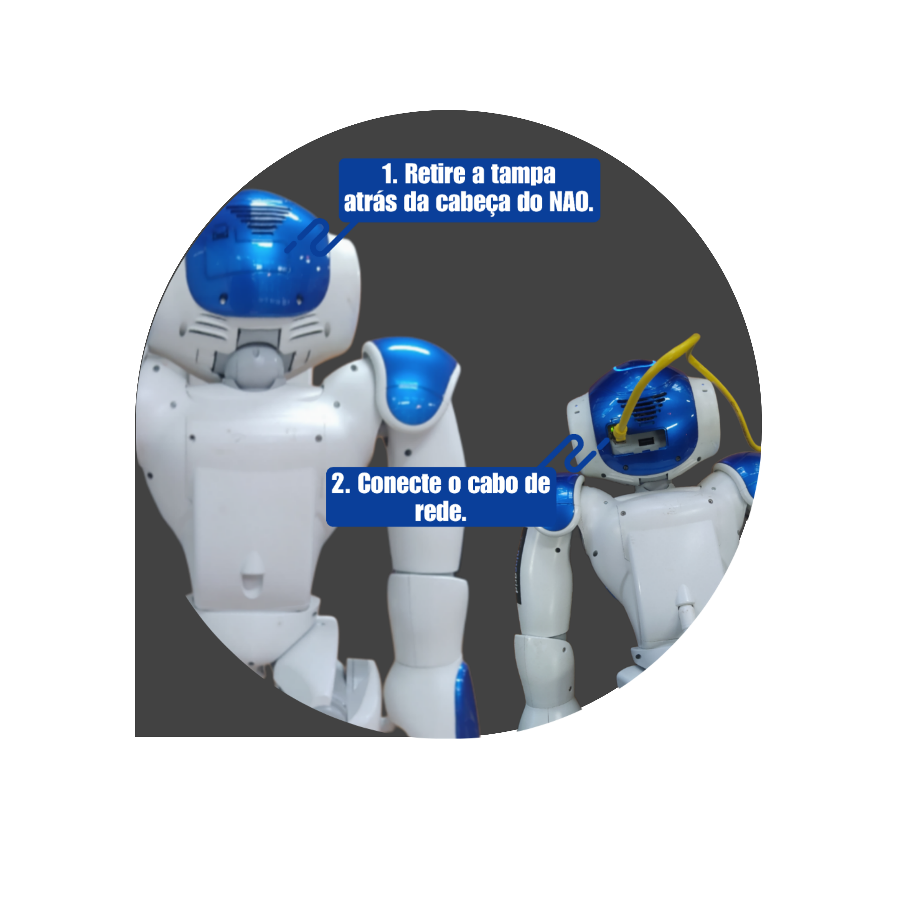
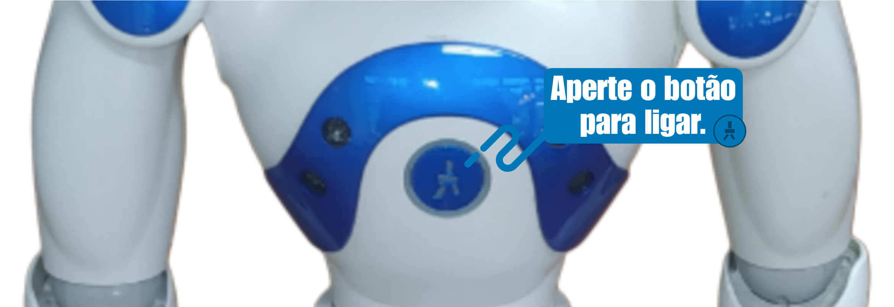
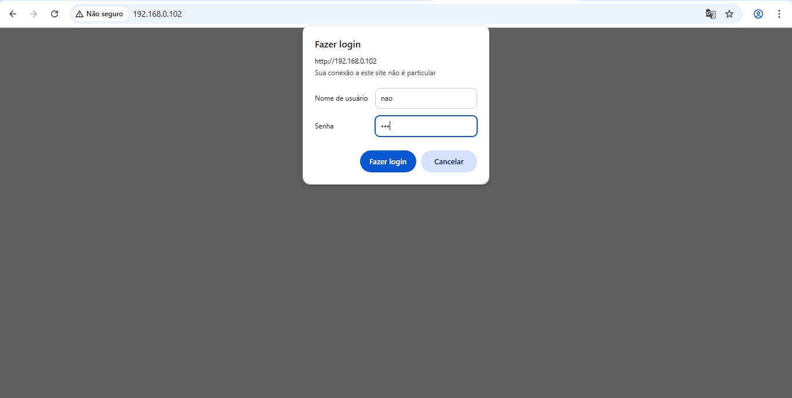
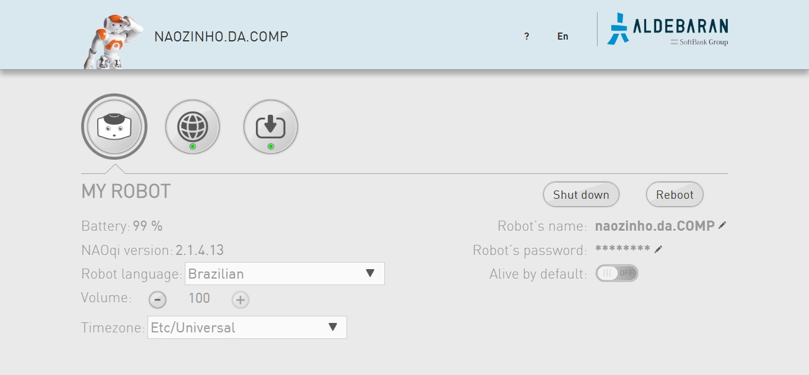

## Conexão inicial

Para fazer conectar o NAO em uma rede não configurada.
É necessário fazer a conexão usando um cabo de rede.
1º Retire a tampa que se encontra atrás da cabeça do NAO.
2º Conecte o cabo de rede no conector fêmea dentro deste compartimento.

Após conectar o cabo, aperte o botão no meio do peito do robô.

Ele irá falar o seu nome e o endereço ip.
(imagem do nao dizendo o ip)
Certifique que seu dispositivo e o NAO, estão na mesma rede. 
Digite o endereço de IP no navegador.

Irá pedir o usuario e senha.

Usuário: nao
Senha: 123

