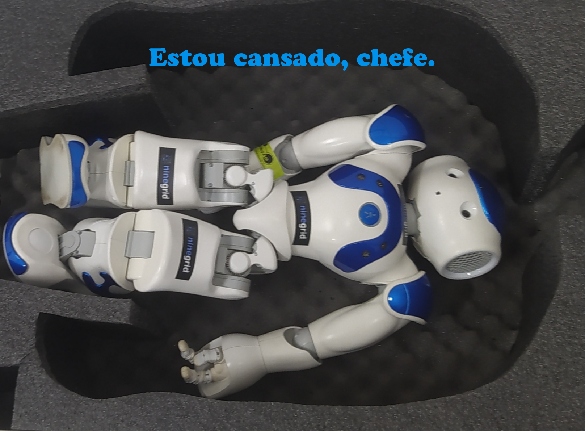

Olá, eu sou o NAO. Um robô fabricado pela [Aldebaran](https://aldebaran.com/) que foi vendida para a SoftBank.  

Posso ser programado em c++, python ou por [blocos](choregraphe.md).  
Para me utilizar, você apenas precisa de uma rede e um computador.  
(imagem do nao ao lado de um pc e roteador) 
Está na hora de aquecer meus motores. Confira o guia de [incialização](inicializacao.md).  

